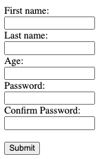
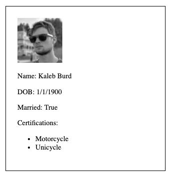

# JS Objects Partner Lab

## Description
You will pair program with a partner to complete this assignemnt. One partner, the driver, should share their screen and be the one typing. The other partner, the observer, should review each line of code. Both partners should be cooperating when solving problems. When an objective has been met, the driver should push the code to the GitHub account, the observer should pull the changes, and the two partners switch roles. 

Please read all three steps before starting each Part and plan your code accordingly. 

## Part One

1. Create the following form in html
1. Create an event listener for the submit button. When it is clicked, gather all the data in the form and display in the console
1. Store all the form data in an object

## Part Two

1. Create an object that represents your drivers license. It should hold your name, DOB, marital status.
2. Use the information in the object to render the following HTML
3. Add img and list of certifications to the license

## Part Three

1. Add all of the teammates data into the `data.js` file. Each team member should have their first and last name, role in the course, and prefered language.
1. Import the data from the provided `data.js` file 
1. Convert each entry in the data in `data.js` into an object

***Happy Hacking!***
